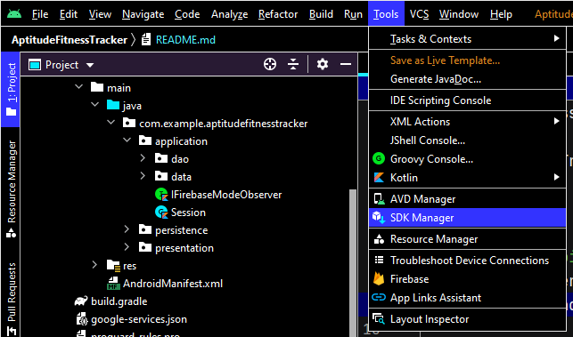
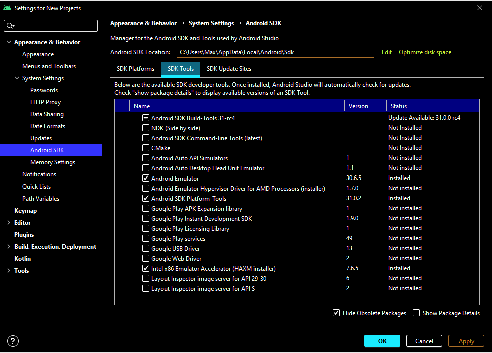
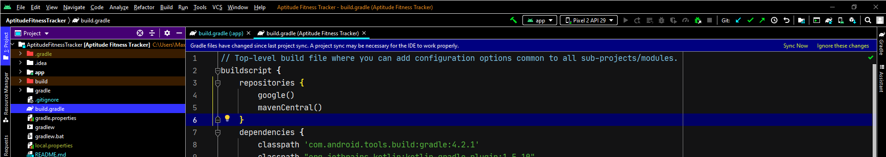

# AptitudeFitnessTracker

AptitudeFitnessTracker is a workout tracking app that lets you input your own exercises and share them with others.

## Install
To run this app:
* Install [Android Studio][androidStudio]
* Open the folder "AptitudeFitnessTracker" with Android Studio. It's the one that contains the "app" folder as well as the "build.gradle" file.
* Install the Android Emulator and Android SDK Platform-Tools, as well as an Android Operating System. These can be found within Android Studio under Tools->SDK Manager, as seen below:

## Build
* Create an Android Virtual Device (AVD) in Android Studio. This is in the same Tools menu as the SDK Manager from the previous step. The details of the AVD are unimportant, but development was primarily done on a Pixel 2, using API Level 29.
* Choose the AVD you created, in the run menu at the top of Android Studio.
* Allow Gradle to sync the dependency files. If the option doesn't present itself, it may help to open the [build.gradle] file to trigger Gradle requesting a sync, as seen below.
* Click the green Run arrow next to the AVD selection.

If difficulties are encountered, the official documentation to run an Android app can be found [at this link][runAppsDocumentation].

## Group 7

Max Anderson ma225bj
Ben Anderson ba222kc
Malek Darwish md222xq

[runAppsDocumentation]: https://developer.android.com/studio/run/emulator
[androidStudio]: https://developer.android.com/studio/